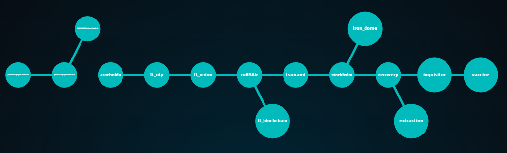

# Cybersecurity Bootcamp 42 Repository

Welcome to my Cybersecurity Bootcamp repository! This repository hosts multiple projects developed as part of the cybersecurity bootcamp organized by the 42 programming campuses. This bootcamp has been one of the most fulfilling experiences in my learning phase, leading me and my colleagues to acquire digital skills in the field of security, one of the most promising areas in the technology industry.

The bootcamp takes place simultaneously at our 42 programming campuses in Madrid, Málaga, Barcelona, and Urduliz. It has been designed in collaboration with Telefónica Tech experts, aiming to equip participants with the necessary skills to specialize in one of the fastest-growing sectors in the digital market. I personally attended the bootcamp in Málaga, where I also take part as a student in the 42 programming campus.

## Methodology

At the bootcamp, we follow the methodology commonly practiced at the 42 programming campuses:

- No traditional instructors
- Emphasis on peer learning and gamification
- No textbooks

## Projects

This repository contains various projects developed by more than 74 students from the programming campuses and over 130 external participants. During the eight-week training program, participants will enhance their digital skills through technical knowledge in the following areas:

- Cryptography
- Network Security
- Secure Development and Protection
- Web Security
- Vulnerabilities
- Computer Forensics
- Malware and Malicious Codes
- OSINT (Open-Source Intelligence) and Open-Source Investigation

The first week of the bootcamp is used to lear basic Python concepts by completing a "Python Piscine" with the following modules:

- Python Module 00 - Eleven commandments
- Python Module 01 - Object-oriented programming
- Python Module 02 - Advanced topics

